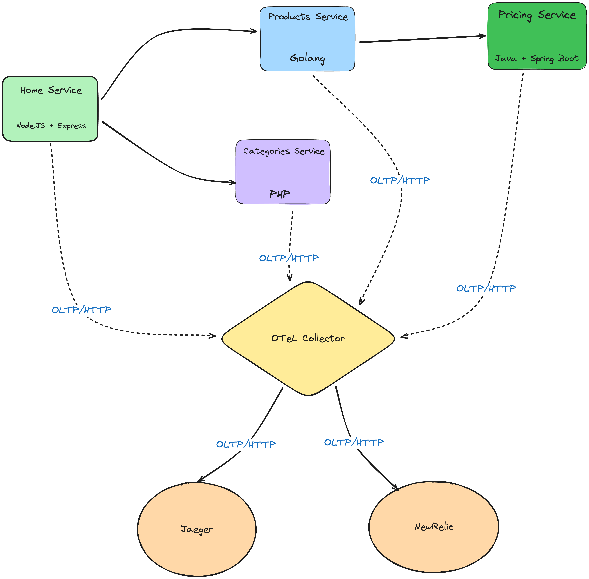

# O11Y PoC
A PoC for a simple microservices architecture applying observability pipeline. This demo provides 4 microservices application each implemented with a different language/framework to demonstrate how to apply instrumentation and tracing with different languages/framework.

## System Diagram


As shown all services export their traces to otel collector service which in turn receive thos traces and run them in the configured `(infra/otel-collector-config.yaml)` pipeline and exports them to other o11y backends. e.g. Jaeger, Zepkin, NewRelic, etc.


## How to setup & run
There's no setup required for this project to run just run the compose file wth docker and magic will appear.
```sh
> docker compose -f infra/docker-compose.yml up -d
```

Once all services start Go to your browser and hit this url [`http://localhost:16686/`](http://localhost:16686/). You should see jeager home page out of which you can search for traces. Now you can put on your detective hat and start digging into your bugs factory :P.

## Contributions
All contributions are welcome to add more example or pipelines.